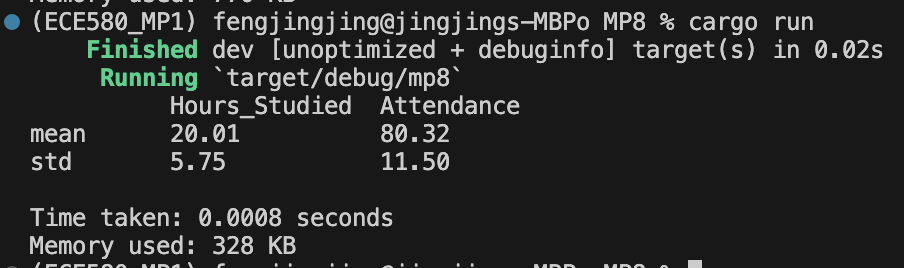
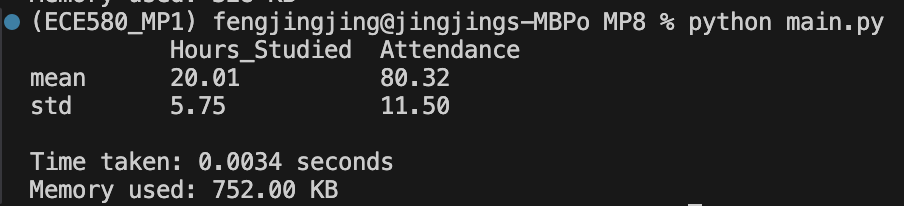

# jf361_ids706_mp8
[](https://github.com/siyiia/jf361_ids706_mp8/actions/workflows/RustCI.yml)
[](https://github.com/siyiia/jf361_ids706_mp8/actions/workflows/PythonCI.yml)

 ## Project Introduction
This project is to rewrite a Python Script in Rust.

## Project Requirments
- Take an existing Python script for data processing
- Rewrite it in Rust
- Highlight improvements in speed and resource usage

## Project Description
This project:
- Calculated the mean and standard deviation of dataset columns in Python and Rust.
- Measured the execution time and memory usage for both implementations.

## Project Setup
To run the project:
1. **Python Implementation**: Run the Python script using:
    ```
   python main.py
   ```
2. **Rust Implementation**: Run the Rust program using:
    ```
   cargo run
   ```


## Performance Comparison Report 
Below are the performance results for both implementations.
### Rust Performance
<p>
  
</p>

### Python Performance
<p>
  
</p>

### Analysis
Based on the results shown:
- Speed: Rust was faster in execution compared to Python.
- Memory Usage: Rust used significantly less memory than Python, which means that Rust’s efficiency in memory management and performance.
